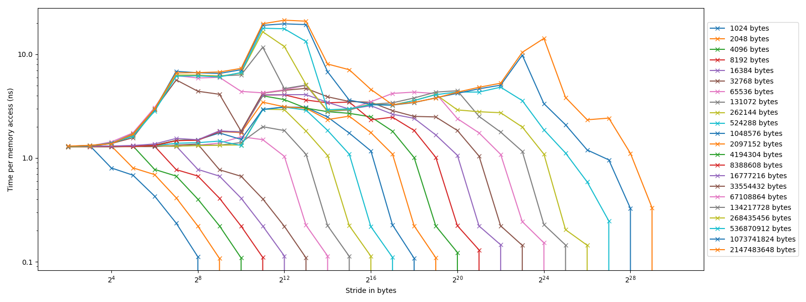

# Hardware Aware Scientifc Computing (HASC) - Exercise 01
Manuel Trageser  
Justin Sostmann  

## Exercise 1 *Pointer Chasing*

### a)
- What happens in the main experiment?  

The main experiment runs a loop `s` times, which is the current stride. Inside that we run a while loop where we access the array at the current index `i`, starting at `i=0` and then set the index `i` to the value at that position. This is repeated until the index is `0` again.  
Essentially, we follow pointers in the array, starting at `0` and ending at `0` again, but with a stride of `s`.

- What is the purpose of the empty experiment and why do we measure its time?  
  
The purpose of the empty experiment is to measure the overhead of the for/while loops themselves, such that we can subtract it from the main experiment and get the actual cache access times.

- Why do we include the loop ``for (int k=0; k<s; k++)``?  

The higher our stride `s` the less array elements we access, so we run the experiment `s` times to overall access the same amount of elements for each stride.

### b)
✅

### c)
``-std=c++17 -O1 -funroll-loops -fargument-noalias``


### d)
```
Model name:            AMD Ryzen 5 5600X 6-Core Processor
  Base Clock: 3.7GHz
  Boost Clock: 4.6GHz
  Thread(s) per core:  2
  Core(s) per socket:  6
  Socket(s):           1
Caches (sum of all):   
  L1d:                   192 KiB (6 instances)  32 KiB per core
  L1i:                   192 KiB (6 instances)  32 KiB per core
  L2:                    3 MiB (6 instances)  512 KiB per core
  L3:                    32 MiB (1 instance)
```

Values below 1:  

  We have less cache misses than accesses, because we access the same elements multiple times, which are then cached.

Stride 1:  

  Only every 16th access is a cache miss, because the cache line size is 64 bytes and we access 4 bytes per element, so we access 16 elements per cache line.
  Cache prefetching loads the next cache line into the cache before we access it, so we have no additional cache misses.
  -> Constant access times, independant of array size

???:  

  Why does the latency increase for strides above 64bytes (cache line size)? 
  At a stride of 64 bytes we should have the maximum amount of cache misses/loads. The higher the stride the less elements are loaded in total, which should result more cached elements -> less cache misses -> lower latency, but this obviously is not the case.

## Exercise 2 *Peak Performance*
### a)
max memory bandwidth = 51.2 GB/s, single-core: 5.84 GFLOP/s, multi-core: 66.85 GFLOP/s
### b)
4.4 GHz (clock frequency turbo) * 6 (number cores) * 2 (cpu instructions per cycle) = 52.8 GFLOP/s

## Exercise 3 *Vectorized Numerical Integration*
### a)
See [midpoint.cc](midpoint.cc) for the implementation.

### b)
See [midpoint.cc](midpoint.cc) for the implementation.

### c)
